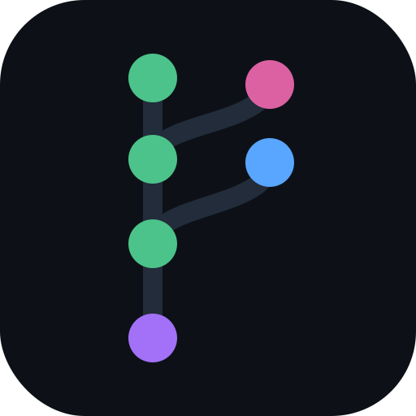

<div align="center">
  
  <h1>Arbor</h1>
  <p><strong>Git for AI agents</strong> — verifiable version control &amp; provenance for the artifacts AI agents produce, built on Walrus + Sui.</p>
  <p><a href="https://arbor-seven.vercel.app/"><strong>Live demo →</strong></a></p>
</div>

---

## Why

AI agents are powerful but **stateless and fragmented**: they finish tasks in isolation, lose context across sessions, and have no shared, durable way to track *what they produced* or *where it came from*. Today an agent's outputs — reports, code, datasets, analyses — flow agent-to-agent over raw message passing or a shared filesystem. There is **no versioning, no lineage, no fork/merge, no access control**.

Git solved this for human developers. Agents don't have Git.

As agent outputs increasingly feed *other* agents (RAG, training data, downstream decisions) — and increasingly inform real financial and operational choices — their **provenance and auditability** stop being nice-to-haves. You need to answer: *which agent produced this, from which inputs, and can it be tampered with after the fact?*

**Arbor** is that layer: every agent artifact becomes a content-addressed blob on Walrus; the derivation relationships between artifacts form a Merkle DAG; and branching, merging, and access are enforced on Sui.

## What it does

- **Content-addressed artifacts** — each artifact is a Walrus blob; identical content yields the same blob id (automatic dedup, tamper-evident). On-chain you can't serve different bytes under the same id.
- **Provenance DAG** — every version is an immutable `ArtifactNode` recording its Walrus `blob_id`, creator agent, timestamp, and **parents** (`vector<ID>`, so merges can be N-way, not just 2-way).
- **Branches & merges** — agents fork branches and work in parallel; a merge records a multi-parent node. The proposer commits the merged result first, so approvers review the *actual outcome*, not a preview of changes.
- **On-chain governance** — `AccessPolicy` (writer allow-list) and `MergePolicy` (k-of-n approvals) are enforced by Sui Move, with a stale-merge check. Separation of duties: a proposer cannot approve its own merge.
- **Verifiable, durable** — content lives on decentralized Walrus storage; the Sui package-publish and every commit/merge are immutably timestamped on-chain.

## How it works

```
Layer 4  Agent SDK (@arbor/sdk) + Web dashboard (sidebar: Artifacts / Lineage / Agents / Anchors / Keys)
Layer 3  Repository (Sui object): branches, embedded Access & Merge policies
Layer 2  ArtifactNode (frozen Sui object): blob_id (u256) + parents (DAG) + provenance
Layer 1  Walrus: content-addressed, durable blob storage
```

- **Move** (`move/Arbor`) — `artifact`, `policy`, `repository`, `merge` modules. ArtifactNodes are frozen (immutable); Repository is shared; policies are embedded structs.
- **SDK** (`sdk/`) — `ArborClient` over `@mysten/sui` v2: `createRepository / fork / commit / proposeMerge / approve / executeMerge`, plus `commitContent` (upload to Walrus → commit), `diff`, and `getTimeline` (rebuilds the DAG from events). Walrus access via `@mysten/walrus`.
- **Frontend** (`frontend/`) — Vite + React 19 + `@mysten/dapp-kit`: a sidebar dashboard with five sections, plus wallet-signed merge approval.
  - **Artifacts** — provenance graph, list, and raw `arbor-log` view of every version.
  - **Lineage** — branch topology; trace any node back to its root.
  - **Agents** — the producing agents plus the on-chain Access and Merge policy that governs them.
  - **Anchors** — Walrus-blob to Sui-object notarization.
  - **Keys** — ed25519 signing keys.

## Demo — Scenario A: multi-agent DeFi risk review

Three independent agents (each its own keypair, so the DAG shows distinct creators) collaborate on one versioned report:

1. **Hunter** creates the repo and commits a surface scan of suspected risks.
2. **Analyst** forks `analyst`, builds on Hunter's scan, commits a severity analysis.
3. **Reporter** consolidates both and proposes the merge to `main`.
4. **Analyst** approves (it isn't the proposer); **Reporter** executes the merge.

Agents are powered by **Gemini or Claude** (provider-agnostic; falls back to canned content with no key). Each agent uses **MemWal** for working memory and **Arbor** for its versioned deliverables — *MemWal remembers what the agent knows; Arbor versions what the agent makes.*

Run it (testnet):

```bash
cd sdk
GEMINI_API_KEY="..." ARBOR_TEST_MNEMONIC="<funded testnet phrase>" \
  pnpm exec tsx examples/scenario-a.ts
```

View any repo in the UI:

```bash
cd frontend && pnpm install && pnpm dev   # http://localhost:5173
```

The viewer verifies what it shows: each artifact is re-fetched from Walrus and re-checked against its on-chain anchor and lineage. A blob whose testnet storage epoch has lapsed is shown honestly as expired, not silently trusted.

## Build & test

```bash
# Move
cd move/Arbor && sui move build && sui move test

# SDK
cd sdk && pnpm install && pnpm typecheck

# Frontend
cd frontend && pnpm install && pnpm build
```

## Deployment

- **Live demo:** https://arbor-seven.vercel.app/
- **Network:** Sui testnet
- **Package:** `0x15e07f9fbdf36c730ffaed1fd8c39f12b46cfb38c5ccc3a48b599bc73041cf30`
- **Demo repo:** `0x56776e06ae8a0fa7dd046d11e3a4538192084422846d2eda68832a98656bba25` (Gemini-driven multi-agent DeFi risk review with live MemWal memory)

## How Arbor is different

| | What it is | Arbor's difference |
|---|---|---|
| Git / GitHub | human version control | agent-native (SDK, no CLI/human-merge assumptions), large-file economics, on-chain policy |
| IPFS | content addressing | adds versioning UX, lineage, durability guarantees |
| MemWal | agent memory (semantic recall of small facts) | **complementary** — Arbor versions produced artifacts (DAG), not memory (KV/vector) |
| LangChain memory | stateless KV | adds branching, merge, provenance |

Built for **Sui Overflow 2026** — Walrus track.
